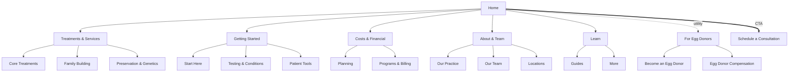

# RMA — Sitemap & Navigation Design

**Prepared by:** Senior Web Developer / UX-UI · **Date:** 2026-06-07
**Scope:** Information architecture for the 51-page RMA of Michigan site.
**Goal:** A logical, low-friction structure that gets users to the right page in the fewest clicks, with no dead ends or miscategorized content.

---

## 1. Design principles (how this solves the problem)

| Stated problem | Design response |
|---|---|
| 50+ pages, hard to organize | Everything rolls up into **5 primary sections** (Hick's Law — fewer top-level choices = faster decisions). |
| Confusing navigation | **Hybrid task + audience IA**: menus match how patients actually think ("what do you treat?", "I'm new", "how do I pay?", "who are you?"). |
| Miscategorized services | The **Egg Donor** audience is split out of patient navigation entirely; **conditions** sit with **testing**, not buried in "Learn"; **preservation & genetics** grouped together. |
| Dead-end pages | Every page carries **breadcrumbs + a "related/next step" cluster + a persistent CTA + a fat footer**, so there is always a forward path. |
| Drop-off / lost users | A dedicated **"Getting Started"** entry for overwhelmed new patients, **Costs surfaced as its own top-level item** (the #1 fertility drop-off concern), and **click-to-call + Schedule** always visible. |

---

## 2. Primary navigation (desktop mega-menu)

**5 sections + a persistent CTA.** Each opens a mega-panel that exposes Level-2 and Level-3 in a single hover, so most destinations are **≤ 2 clicks from anywhere**.



### Menu 1 — Treatments & Services  *(feature link: "View all treatments →" `/treatments/`)*
| Core Treatments | Family Building | Preservation & Genetics |
|---|---|---|
| IVF | Donor Egg IVF | Egg Freezing |
| IUI | Gestational Carrier | PGT-A Genetic Testing |
| Ovulation Induction | LGBTQ+ Family Building | ERA Testing |
| Fertility Surgery | Single Parent Path | |

### Menu 2 — Getting Started  *(feature: "New here? Schedule a consultation →")*
| Start Here | Testing & Conditions | Patient Tools |
|---|---|---|
| Your Fertility Journey (Guide) | Fertility Testing | Patient Portal |
| Schedule a Consultation | Male Infertility | Patient Forms |
| First Visit & Morning Monitoring | PCOS & Fertility | Patient Resources · FAQ |

### Menu 3 — Costs & Financial  *(feature: "Get a personalized estimate →")*
| Planning | Programs & Billing |
|---|---|
| Insurance | Grants — Christen Goff IVF Grant |
| Financing | IVF Medication Savings |
| Financial Assistance | Pay My Bill · Business Office |

### Menu 4 — About & Team
| Our Practice | Our Team | Locations |
|---|---|---|
| About RMA | Physicians (+ 5 bios) | Troy Fertility Clinic |
| Careers | Clinical Team · Lab Team | Livonia — Opening Soon |
| | Advanced Practice Providers | Ohio Patients |
| | Patient Services | Out-of-Town Patients |

### Menu 5 — Learn
| Guides | More |
|---|---|
| Fertility Guide | Blog |
| Diet & Nutrition | FAQ |
| Patient Education Videos | Resources |

**Persistent CTA button:** `Schedule a Consultation`

---

## 3. Utility navigation (slim top bar)
Always visible, above the main nav:
`📞 (248) 619-3100`  ·  `Patient Portal ↗ (login)`  ·  `Become an Egg Donor`  ·  `🔍 Search`

- **Click-to-call** is first — fertility patients frequently want to talk to a human.
- **Become an Egg Donor** lives here (not in patient menus) because donors are a **different audience** with a different intent — this is the key fix for "miscategorized services."

---

## 4. "For Egg Donors" (separate audience track)
Reachable from the utility bar and a dedicated footer column — never mixed into patient treatment menus:
- Become an Egg Donor (`/egg-donation/`)
- Egg Donor Compensation (`/egg-donor-compensation/`)

---

## 5. Footer (fat footer — secondary global nav)
A comprehensive footer doubles as a site index and a safety net for anyone who scrolls past what they need:

| Treatments | Getting Started | Costs | About | For Egg Donors |
|---|---|---|---|---|
| IVF · IUI | Schedule | Insurance | About RMA | Become a Donor |
| Egg Freezing | Fertility Testing | Financing | Our Doctors | Compensation |
| Donor Egg IVF | Patient Portal | Grants | Locations | |
| LGBTQ+ Family Building | Forms · FAQ | Pay My Bill | Careers | |

**Contact block:** NAP (130 Town Center Dr, Suite 106, Troy, MI 48084) · hours · phone · social · newsletter.
**Legal bar:** Privacy Policy · Accessibility · Terms · **HTML Sitemap** · © RMA of Michigan.
*(Privacy, Accessibility, Terms, a dedicated Contact page, and an HTML Sitemap are recommended additions — see §8.)*

---

## 6. Contextual / in-page navigation (no dead ends)
- **Breadcrumbs** on every page: `Home › Section › Page` (already wired to `BreadcrumbList` schema).
- **In-page jump-nav (TOC)** on long pages, with sticky-header scroll offset.
- **"Related services / Continue your journey"** cluster at the bottom of every service page — turns a terminal page into a launchpad.
- **Section-level CTAs** + a closing contact panel on every page.

---

## 7. Mobile navigation
- **Hamburger → full-screen accordion** mirroring the 5 sections (progressive disclosure; no tiny hover targets).
- **Sticky bottom action bar:** `Call` + `Schedule` — thumb-reachable, always present (these are the two highest-value actions).
- Utility links (Portal, Donor, Search) collapse into the top of the drawer.
- Already keyboard-accessible with `aria-expanded`, Escape-to-close, and focus styles.

---

## 8. Complete sitemap (all 51 pages + recommended additions)

```
Home (/)
├── Treatments & Services ............. /treatments/   (hub)
│   ├── Core Treatments
│   │   ├── IVF ....................... /ivf/
│   │   ├── IUI ....................... /iui/
│   │   ├── Ovulation Induction ....... /ovulation-induction/
│   │   └── Fertility Surgery ......... /fertility-surgery/
│   ├── Family Building
│   │   ├── Donor Egg IVF ............. /donor-egg-ivf/
│   │   ├── Gestational Carrier ....... /gestational-carrier/
│   │   ├── LGBTQ+ Family Building .... /lgbtq-fertility/
│   │   └── Single Parent Path ........ /single-parent-fertility/
│   └── Preservation & Genetics
│       ├── Egg Freezing ............. /egg-freezing/
│       ├── PGT-A Genetic Testing .... /pgt-a/
│       └── ERA Testing .............. /era-testing/
├── Getting Started
│   ├── Start Here
│   │   ├── Your Fertility Journey ... /fertility-guide/
│   │   ├── Schedule a Consultation .. /appointments/
│   │   └── First Visit & Monitoring . /morning-monitoring/
│   ├── Testing & Conditions
│   │   ├── Fertility Testing ........ /fertility-testing/
│   │   ├── Male Infertility ......... /male-infertility/
│   │   └── PCOS & Fertility ......... /pcos-and-fertility/
│   └── Patient Tools
│       ├── Patient Portal ........... /patient-portal/
│       ├── Patient Forms ............ /forms/
│       ├── Patient Resources ........ /resources/
│       └── FAQ ...................... /faq/
├── Costs & Financial
│   ├── Insurance .................... /insurance/
│   ├── Financing .................... /financing/
│   ├── Financial Assistance ......... /financial-assistance/
│   ├── Grants (Christen Goff) ....... /grants/
│   ├── IVF Medication Savings ....... /ivf-medication-savings/
│   ├── Pay My Bill .................. /billpay/
│   └── Business Office .............. /business-office/
├── About & Team
│   ├── Our Practice
│   │   ├── About RMA ................ /about/
│   │   └── Careers ................. /careers/
│   ├── Our Team
│   │   ├── Physicians .............. /our-doctors/
│   │   │   ├── Dr. Brad T. Miller .. /doctors/brad-miller/
│   │   │   ├── Dr. Lynda J. Wolf ... /doctors/lynda-wolf/
│   │   │   ├── Dr. Jenny S. George . /doctors/jenny-george/
│   │   │   ├── Dr. Annette Lee ..... /doctors/annette-lee/
│   │   │   └── Dr. Molly Moravek ... /doctors/molly-moravek/
│   │   ├── Clinical Team ........... /clinical-team/
│   │   ├── Laboratory Team ......... /lab-team/
│   │   ├── Advanced Practice Providers /advanced-practice-providers/
│   │   └── Patient Services ........ /patient-services/
│   └── Locations
│       ├── Troy Fertility Clinic ... /troy-fertility-clinic/
│       ├── Livonia (Opening Soon) .. /livonia-fertility-clinic/
│       ├── Ohio Patients ........... /ivf-ohio/
│       └── Out-of-Town Patients .... /out-of-town-patients/
├── Learn
│   ├── Fertility Guide ............. /fertility-guide/        (cross-linked)
│   ├── Diet & Nutrition ............ /fertility-diet-and-nutrition/
│   ├── Patient Education Videos .... /patient-education-videos/
│   ├── Blog ........................ /blog/
│   ├── FAQ ......................... /faq/                    (cross-linked)
│   └── Resources ................... /resources/              (cross-linked)
├── For Egg Donors (separate audience)
│   ├── Become an Egg Donor ......... /egg-donation/
│   └── Egg Donor Compensation ...... /egg-donor-compensation/
└── Utility / Conversion
    └── Schedule a Consultation ..... /appointments/           (persistent CTA)

Recommended NEW pages (close trust + compliance gaps):
  • Contact (dedicated)        • Privacy Policy
  • Accessibility Statement    • Terms of Use
  • HTML Sitemap (/sitemap page for humans)   • Search results
```

All **51 existing pages are placed**; nothing is orphaned. Cross-listed pages (Guide, FAQ, Resources, Patient Services) appear in the one or two places users would most likely look — intentional, not accidental.

---

## 9. URL strategy
Keep the **current flat URLs** (`/ivf/`, `/about/`). They're already indexed and SEO-clean; the *logical* hierarchy above is expressed through **breadcrumbs, menu grouping, and internal links**, not the URL path. If deeper nesting is ever desired (e.g., `/treatments/ivf/`), it must ship with 301 redirects — otherwise leave URLs as-is.

---

## 10. Validation plan (recommended before build)
1. **Card sort** (open + closed, ~15 participants) to confirm the 5-bucket grouping and the conditions-vs-services split.
2. **Tree test** on this structure — target ≥ 80% task success for "find IVF cost," "book a consult," "become an egg donor," "find the Troy address."
3. **First-click testing** on the homepage hero + mega menu.
4. Re-test after launch with analytics (drop-off funnels, in-page search terms, dead-click maps).

---

### ✅ Implementation status — LIVE across all 51 pages
This IA is **implemented**, not just specced:
- **Utility bar:** phone · Patient Portal · Become an Egg Donor · Locations.
- **5-section mega-menu** (Treatments · Getting Started · Costs & Financial · About & Team · Learn) + persistent **Schedule** CTA — same JS hooks, so the existing accordion/keyboard behavior is preserved.
- **Fat footer** rebuilt to 4 link columns + brand + newsletter, plus a sub-bar with the **For Egg Donors** track, a Sitemap link, and copyright.
- **Mobile sticky action bar** (`Call` · `Schedule`) on every page below 1180px.
- Depth-aware relative paths (root / one-level / `doctors/*` two-level) all resolve; validation: **0 broken links, 0 invalid JSON-LD, 0 structure gaps** across 51 pages.
- *(Privacy / Accessibility / Terms / Contact / HTML-Sitemap pages are stubbed as a footer TODO — they don't exist yet, so they're intentionally not linked to avoid creating new dead ends.)*

### Change vs. the previous menu (what improved and why)
- **Was:** "Become an Egg Donor" sat inside *Care Options → Family Building* (patient menu) → **Now:** its own audience track (utility + footer). *Fixes the clearest miscategorization.*
- **Was:** Conditions (Male Infertility, PCOS) and Fertility Testing lived under *Learn* → **Now:** under *Getting Started → Testing & Conditions*, where patients expect diagnosis content.
- **Was:** Costs buried inside *Patient Resources* → **Now:** promoted to a top-level *Costs & Financial* menu (surfaces the top drop-off concern; pulls in `billpay` + `business-office`, previously not in nav).
- **Added:** *Getting Started* as a guided entry for new/overwhelmed users; consistent breadcrumbs, related-links, and a fat footer to eliminate dead ends.
